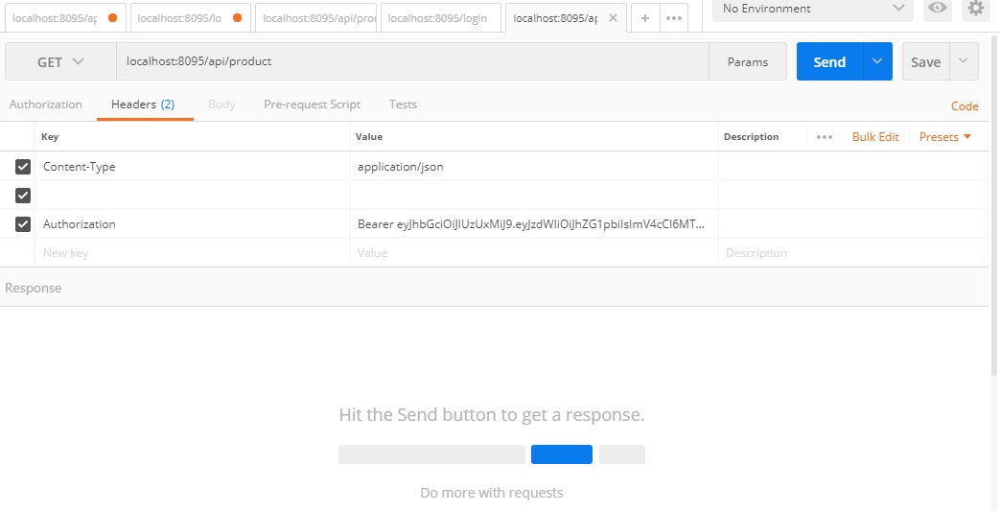

# spring-boot-cap
Attempt to create a sample Spring boot application having 
* REST 
* MongoDB (https://mlab.com/databases/mongo_y)
* Security (https://github.com/spring-projects/spring-boot/wiki/Spring-Boot-Security-2.0)
* Monitoring and Tracking features 
  https://docs.spring.io/spring-boot/docs/current-SNAPSHOT/actuator-api/html/_
  https://docs.spring.io/spring-boot/docs/current-SNAPSHOT/reference/htmlsingle/#production-ready
  
### After downloading code, 
- update the resources/application.properties file with appropriate settings 
- mvn clean install 
- mvn spring-boot:run
- log-in using http://localhost:8095/login

- access/update data as 

- view health of you application at (note that you have to use token to access this link)
  http://localhost:8095/manage/health
  http://localhost:8095/manage/beans etc
  