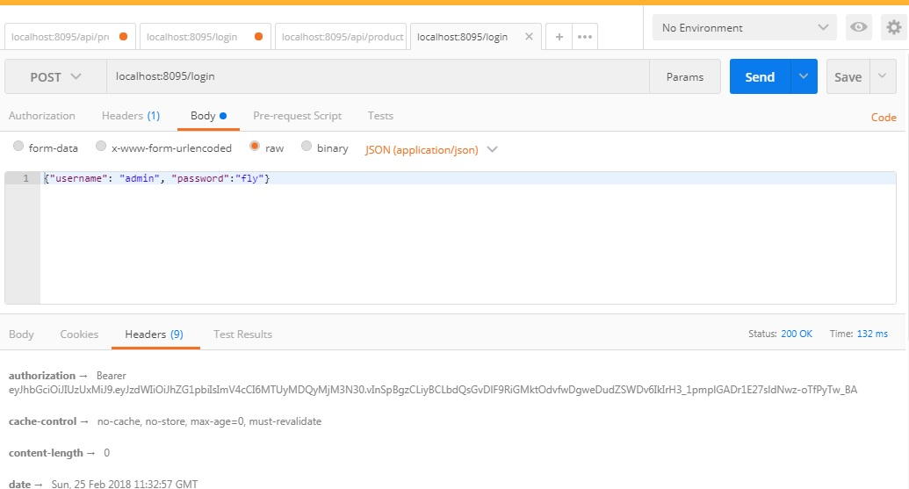

# spring-boot-cap
Attempt to create a sample Spring boot application having 
* REST 
* MongoDB (https://mlab.com/databases/mongo_y)
* Security 
* Monitoring and Tracking features

###After downloading code, 
- update the resources/application.properties file with appropriate settings 
- mvn clean install 
- mvn spring-boot:run
- log-in using http://localhost:8095/login

